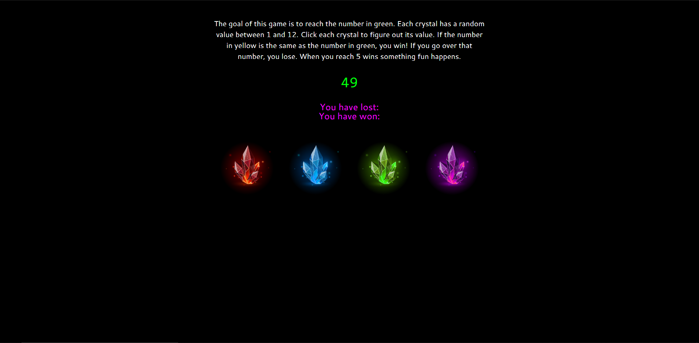

# Crystal Game

## About
An interesting numbers-based game where crystals are assigned a unique value each time the game is started. A random number will show up on screen and the goal is to figure out how much each crystal is "worth" then match the values to a value displayed at the start of the game. If you go above the value, you lose. Every 5 wins, something cool will happen :)

#### Deployed version: https://bradydouthit.github.io/crystal-game/  

## Built with:  
HTML5, CSS3, JavaScript
